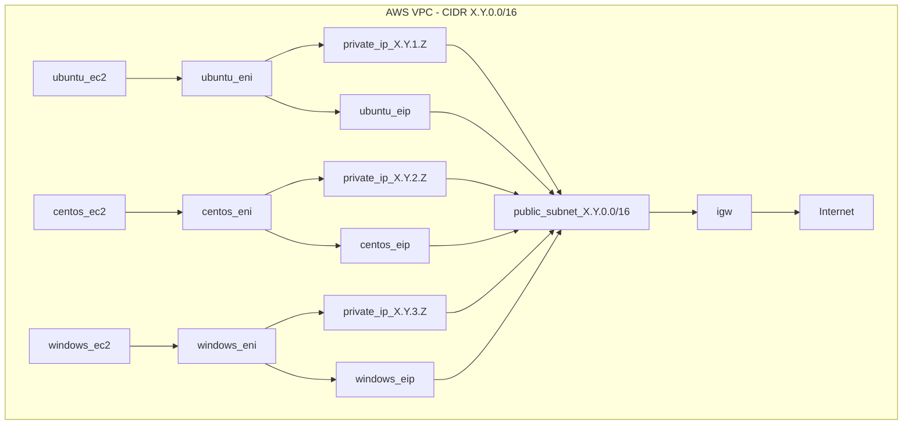

# aws-tf-lab

Deploy a simple AWS lab environment for testing various host OS types

## Table of Contents

- [Software Requirements](#software-requirements)
- [Topology](#topology)
- [After You Clone the Repository](#after-you-clone-the-repository)
- [Deploying the Lab](#deploying-the-lab)
- [Accessing the Lab](#accessing-the-lab)
- [Modifying the Lab](#modifying-the-lab)
- [Destroying the Lab](#destroying-the-lab)

<a name="software-requirements"></a>

## Software Requirements

- [AWS](https://aws.amazon.com/)
- [Terraform CLI](https://learn.hashicorp.com/tutorials/terraform/install-cli)

This repository was built and tested on Ubuntu Server 22.04 LTS.

<a name="topology"></a>

## Topology



<a name="after-you-clone-the-repository"></a>

## After You Clone the Repository

### Add the terraform.tfvars file

The .gitignore file excludes .tfvars files. If you are running this code locally, you will need a tfvars file to provide the necessary API keys for AWS. An example of what you will need to create and put in the root directory is shown below. Alternatively, you can use a remote (Terraform Cloud) for securely storing sensitive information without risking accidental exposure in your repository.

**Command**

```shell
cd aws-tf-lab/
```

**Command**

```shell
sudo vim terraform.tfvars
```

**Input**

```shell
# copy and paste contents with your specific values into terraform.tfvars file

aws_access_key = "<AWS_ACCESS_KEY>"
aws_secret_key = "<AWS_SECRET_KEY>"
aws_token      = "<AWS_TOKEN>"

# save and exit the file editor
```

<a name="deploying-the-lab"></a>

## Deploying the Lab

1. Initialize the Terraform in the working directory

**Command**

```shell
pwd
```

**Example Output**

```shell
../aws-tf-lab
```

**Command**

```shell
terraform init
```

**Example Output**

```shell
Initializing modules...
- us_east_2 in vpc_template
- us_west_2 in vpc_template

<OUTUT OMITTED FOR BREVITY>

Terraform has been successfully initialized!

You may now begin working with Terraform. Try running "terraform plan" to see
any changes that are required for your infrastructure. All Terraform commands
should now work.
```

2. Run a plan and review the output

**Command**

```shell
terraform plan
```

**Example Output**

```shell
<OUTUT OMITTED FOR BREVITY>

Plan: 40 to add, 0 to change, 0 to destroy.

Changes to Outputs:
  + us_east_2_centos_public_ip  = [
      + (known after apply),
    ]
  + us_east_2_ubuntu_public_ip  = [
      + (known after apply),
    ]
  + us_east_2_windows_public_ip = [
      + (known after apply),
    ]
  + us_west_2_centos_public_ip  = [
      + (known after apply),
    ]
  + us_west_2_ubuntu_public_ip  = [
      + (known after apply),
    ]
  + us_west_2_windows_public_ip = [
      + (known after apply),
    ]
```

3. Apply

**Command**

```shell
terraform apply
```

**Example Output**

```shell
<OUTUT OMITTED FOR BREVITY>

Do you want to perform these actions?
  Terraform will perform the actions described above.
  Only 'yes' will be accepted to approve.

  Enter a value: yes
```

**Example Output**

```shell
<OUTUT OMITTED FOR BREVITY>

Apply complete! Resources: 40 added, 0 changed, 0 destroyed.

Outputs:

us_east_2_centos_public_ip = [
  "192.0.2.39",
]
us_east_2_ubuntu_public_ip = [
  "192.0.2.15",
]
us_east_2_windows_public_ip = [
  "192.0.2.225",
]
us_west_2_centos_public_ip = [
  "192.0.2.2",
]
us_west_2_ubuntu_public_ip = [
  "192.0.2.157",
]
us_west_2_windows_public_ip = [
  "192.0.2.236",
]
```

<a name="accessing-the-lab"></a>

## Accessing the Lab

Once the EC2 instances are initialized in AWS, you can SSH to the Linux hosts and RDP to the Windows hosts.

- The private key is located in the aws-tf-lab directory with the filename ec2.pem.
- For Windows host you will need to retrieve the RDP password from the AWS console.

**Command**

```shell
ls | grep *.pem
```

**Example Output**

```shell
ec2.pem
```

To login to a Linux host simply specify the private key, username and target public IP address. 

For Ubuntu the username is **ubuntu** and for CentOS the username is **centos**.

To retrieve the public IP addresses of the EC2 instances, use the following Terraform command:

**Command**

```shell
terraform output
```

**Example Command**

```shell
ssh -i ec2.pem ubuntu@192.0.2.15

The authenticity of host '192.0.2.15 (192.0.2.15)' can't be established.
ED25519 key fingerprint is SHA256:RGeANdYlbJD3g1m5EzU+/X0BO9mBZG8FjWb3u+kQtdA.
This key is not known by any other names
Are you sure you want to continue connecting (yes/no/[fingerprint])? yes

<OUTUT OMITTED FOR BREVITY>

ubuntu@ip-10-68-1-0:~$
```

```shell
ssh -i ec2.pem centos@192.0.2.39

The authenticity of host '192.0.2.39 (192.0.2.39)' can't be established.
ED25519 key fingerprint is SHA256:RGeANdYlbJD3g1m5EzU+/X0BO9mBZG8FjWb3u+kQtdA.
This key is not known by any other names
Are you sure you want to continue connecting (yes/no/[fingerprint])? yes

<OUTUT OMITTED FOR BREVITY>

[centos@ip-10-68-2-0 ~]$
```

<a name="modifying-the-lab"></a>

## Modifying the Lab

### Customizing the Number of EC2 Instances

In the main.tf file in the aws-lab repository adjust the following values to the desired number of instances for each:

- ubuntu_count: the number of ubuntu ec2 instances
- windows_count: the number of windows ec2 instances
- centos_count: the number of centos ec2 instances

Setting the value to 0 will result in no hosts of the specified type being created.

**Example Code Block**

```shell
module "us_east_2" {
  source = "./vpc_template"

  providers = {
    aws = aws.ohio
  }

  public_key     = tls_private_key.ec2.public_key_openssh
  aws_access_key = var.aws_access_key
  aws_secret_key = var.aws_secret_key
  cidr_block     = "10.68.0.0/16"
  name_prefix    = "aws-tf-lab-"
  ubuntu_count   = 2
  ubuntu_type    = "t3.small"
  windows_count  = 2
  windows_type   = "t3.small"
  centos_count   = 2
  centos_type    = "t3.small"
}
```

### Customizing the EC2 Type

In the main.tf file in the aws-lab repository adjust the following values to the desired number of instances for each:

- ubuntu_type: the instance size that determines number of vCPU and amount of memory
- windows_type: the instance size that determines number of vCPU and amount of memory
- centos_type: the instance size that determines number of vCPU and amount of memory

The default is t3.small, but if you need more or less CPU/Memory change the value to what will fit the need for testing.

**Example Code Block**

```shell
module "us_east_2" {
  source = "./vpc_template"

  providers = {
    aws = aws.ohio
  }

  public_key     = tls_private_key.ec2.public_key_openssh
  aws_access_key = var.aws_access_key
  aws_secret_key = var.aws_secret_key
  cidr_block     = "10.68.0.0/16"
  name_prefix    = "aws-tf-lab-"
  ubuntu_count   = 2
  ubuntu_type    = "t3.small"
  windows_count  = 2
  windows_type   = "t3.small"
  centos_count   = 2
  centos_type    = "t3.small"
}
```

### Adding Another Region

In the provider.tf file in the aws-lab repository copy one of the AWS provider blocks and paste it below the others. Modify the two values:

- region
- alias

The example below shows adding the US East 1 region to the provider.tf file.

**Example Code Block**

```shell
provider "aws" {
  region     = "us-east-1"
  alias      = "virginia"
  access_key = var.aws_access_key
  secret_key = var.aws_secret_key
  token      = var.aws_token
  default_tags {
    tags = var.required_tags
  }
}
```

Once the new provider is added, to use it in the lab modify the main.tf file in aws-tf-lab by copying and pasting one of the modules to the bottom of the file. Adjust the following variables:

- module
- providers
- cidr_block

**Example Code Block**

```shell
module "us_east_1" {
  source = "./vpc_template"

  providers = {
    aws = aws.virginia
  }

  public_key     = tls_private_key.ec2.public_key_openssh
  aws_access_key = var.aws_access_key
  aws_secret_key = var.aws_secret_key
  cidr_block     = "10.70.0.0/16"
  name_prefix    = "aws-tf-lab-"
  ubuntu_count   = 1
  ubuntu_type    = "t3.small"
  windows_count  = 1
  windows_type   = "t3.small"
  centos_count   = 1
  centos_type    = "t3.small"
}
```

In the outputs.tf file in aws-tf-lab, make sure to add the output references so that you can easily retrieve the public IP addresses of the new EC2 instances. Building on the example show, the code block below will show adding the necessary outputs for adding the US East 1 module.

**Example Code Block**

```shell
output "us_east_1_ubuntu_public_ip" {
  value = module.us_east_1.ubuntu_public_ip
}

output "us_east_1_centos_public_ip" {
  value = module.us_east_1.centos_public_ip
}

output "us_east_1_windows_public_ip" {
  value = module.us_east_1.windows_public_ip
}
```

Initialize the provider and the module and you will be able to build the lab in the specified region.

**Command**

```shell
terraform init
```

<a name="destroying-the-lab"></a>

## Destroying the Lab

 Cloud costs can be expensive, and it is prudent to not leave a lab running any longer than you need it. And with how quickly this lab can be (re)built, there is no reason to leave it in perpetuity.

 1. Run terraform destroy

**Command**

```shell
terraform destroy
```

**Example Output**

```shell
<OUTPUT OMITTED FOR BREVITY>

  Enter a value: yes

<OUTPUT OMITTED FOR BREVITY>

Destroy complete! Resources: 40 destroyed.
```

That's it. All the components in AWS have been removed.
